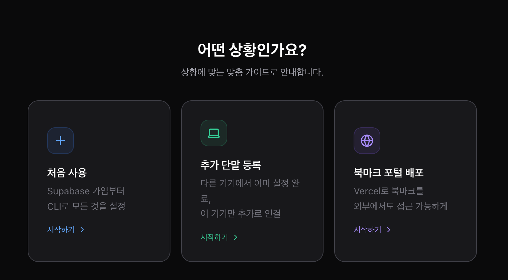

# 포트 관리 프로그램

> **개발자의 로컬 환경을, 어디서나 쓸 수 있게.**

터미널을 열고, 포트 번호를 외우고, 어떤 서버가 켜져 있는지 확인하는 데 지치셨나요?  
포트 관리 프로그램은 로컬 개발 서버를 **한 화면에서 실행·중지·모니터링**하고,  
자주 쓰는 링크와 폴더를 **북마크로 정리해 Vercel에 배포**하여 맥, 윈도우, 스마트폰 어디서든 꺼내 씁니다.  
여러 대 기기를 쓰더라도 Supabase 한 번 연결로 **자동 동기화** — 세팅은 한 번, 편의는 영원히.



---

로컬 개발 서버의 포트와 프로젝트를 관리하는 **Tauri + React 앱**입니다.  
웹 브라우저(`http://localhost:9000`)에서도 동작하며, 북마크 탭은 Vercel을 통해 외부 배포도 가능합니다.

---

## 주요 기능

| 기능 | 설명 |
|---|---|
| 포트 실행/중지 | 실행 파일 연동, 강제 재실행 지원 |
| 실시간 상태 감지 | 포트 점유 여부 자동 감지 |
| 다기기 동기화 | Supabase Push/Pull — 기기별 독립 ID |
| 다른 기기 데이터 보기 | 설정 → 고급 설정 → 단말 조회 → 선택 → Pull |
| AI 추천 이름 | Claude Code로 프로젝트명 자동 생성 |
| 북마크 포털 | 자주 쓰는 링크·폴더 카테고리 관리 + Vercel 외부 배포 |
| 검색 | 이름, AI 별칭, URL, 경로 통합 검색 |

---

## macOS 시작하기

### Step 1. 사전 설치

```bash
# Bun (JavaScript 런타임)
curl -fsSL https://bun.sh/install | bash

# Git (Xcode Command Line Tools)
xcode-select --install
# 또는
brew install git
```

설치 확인:
```bash
bun --version
git --version
```

> **Claude Code (AI 기능 사용 시)**
> ```bash
> npm install -g @anthropic-ai/claude-code
> claude
> ```
> Claude Code 없이도 포트 관리 기능은 모두 사용 가능합니다.

---

### Step 2. 저장소 받기

```bash
git clone https://github.com/intenet1001-commits/portmanagement.git
cd portmanagement
bun install
```

---

### Step 3. 실행

```bash
bun run start
```

API 서버(3001) + 개발 서버(9000)가 동시 시작됩니다.

**간편 실행 (더블클릭)**
```
실행.command   ← Finder에서 더블클릭
```

브라우저에서 **http://localhost:9000** 열기

---

### Step 4. 초기 설정 마법사

앱을 처음 실행하면 **초기 설정 마법사**가 자동으로 시작됩니다.

```
🚀 세팅 버튼 → 처음 사용 / 추가 단말 중 선택 → 단계별 안내
```

마법사가 자동으로 처리하는 항목:

| 단계 | 내용 |
|---|---|
| 1. Supabase 계정 | 가입 안내 (이미 있으면 스킵) |
| 2. CLI 설치 | Supabase CLI 설치 + 브라우저 로그인 |
| 3. 프로젝트 선택 | 기존 프로젝트 선택 또는 새 프로젝트 생성 |
| 4. 테이블 생성 | SQL 마이그레이션 자동 실행 |
| 5. Key 입력 | CLI 인증 시 URL + Anon Key 원클릭 자동 입력 |
| 6. 연결 테스트 | Supabase 연결 확인 |

> **이미 CLI 로그인 상태라면**: 마법사에서 "CLI 자동 가져오기" 버튼으로 URL + Anon Key를 한 번에 입력합니다.

---

### Step 5. 데이터 동기화 (다기기 사용 시)

| 동작 | 방법 |
|---|---|
| 이 기기 데이터 → Supabase | 프로젝트 관리 탭 → **Push** |
| Supabase → 이 기기 복원 | **Pull** |
| 다른 기기 데이터 보기 | ⚙ 설정 → 고급 설정 → 단말 조회 → 기기 선택 → 저장 → Pull |

> Pull 시 다른 기기의 경로(`folderPath`)는 비어있는 상태로 가져옵니다. Pull 완료 후 경로 설정 창이 자동으로 열립니다.

---

### 기존 기기 → 새 맥으로 이전

```bash
git clone https://github.com/intenet1001-commits/portmanagement.git
cd portmanagement
bun install
bun run start
```

앱 실행 후:
```
🚀 세팅 버튼 → 추가 단말 등록 → URL & Key 입력 (또는 CLI 자동 가져오기) → 이 기기 이름 입력 → Pull
```

---

## Windows 시작하기

### Step 1. 사전 설치

PowerShell을 **관리자 권한**으로 열고 실행:

```powershell
# Bun 설치
powershell -c "irm bun.sh/install.ps1 | iex"

# Git 설치
winget install Git.Git
```

> `winget` 명령이 없는 경우 → [트러블슈팅](#windows-트러블슈팅) 참고

새 PowerShell 창을 열고 설치 확인:
```powershell
bun --version
git --version
```

> **Claude Code (AI 기능 사용 시)**
> ```powershell
> npm install -g @anthropic-ai/claude-code
> claude
> ```

---

### Step 2. 저장소 받기

```powershell
git clone https://github.com/intenet1001-commits/portmanagement.git
cd portmanagement
bun install
```

---

### Step 3. 실행

```powershell
bun run start
```

**간편 실행 (더블클릭)**
```
start.bat   ← 탐색기에서 더블클릭
```

> 방화벽 허용 팝업이 뜨면 **허용**을 선택하세요.

브라우저에서 **http://localhost:9000** 열기

---

### Step 4. 초기 설정 마법사

macOS와 동일하게 앱 첫 실행 시 **초기 설정 마법사**가 시작됩니다.

**Windows 전용 — Supabase CLI 사전 설치**

마법사 실행 전 CLI를 먼저 설치하면 "CLI 자동 가져오기" 기능을 사용할 수 있습니다.

```powershell
# Scoop 패키지 매니저 설치 (PowerShell 관리자 권한)
Set-ExecutionPolicy RemoteSigned -Scope CurrentUser -Force
irm get.scoop.sh | iex

# 새 PowerShell 창을 열고 Supabase CLI 설치
scoop bucket add supabase https://github.com/supabase/scoop-bucket.git
scoop install supabase

# 확인
supabase --version
```

Scoop 없이 직접 설치:
```powershell
irm https://github.com/supabase/cli/releases/latest/download/supabase_windows_amd64.zip -OutFile supabase.zip
Expand-Archive supabase.zip -DestinationPath "$env:USERPROFILE\supabase-cli"
$env:Path += ";$env:USERPROFILE\supabase-cli"
```

> CLI 설치 후 반드시 **새 터미널 창**을 열어야 `supabase` 명령이 인식됩니다.

---

### 기존 기기 → 새 Windows PC로 이전

```powershell
git clone https://github.com/intenet1001-commits/portmanagement.git
cd portmanagement
bun install
bun run start
```

앱 실행 후:
```
🚀 세팅 버튼 → 추가 단말 등록 → URL & Key 입력 → 이 기기 이름 입력 → Pull
```

---

## 초기 설정 마법사 (온보딩)

앱을 처음 사용한다면 설정 마법사에서 Supabase 연결, 기기 등록, 환경 설정을 한 번에 완료하세요.

> Vercel 배포된 설정 마법사는 비공개 운영 중입니다.  
> 로컬에서 실행하려면: `bun run dev` 후 `http://localhost:9000/setup` 접속

---

## 앱 빌드 (배포 패키지 생성)

### macOS

```bash
bun run tauri:build      # .app 번들
bun run tauri:build:dmg  # DMG 배포 패키지
```

빌드 결과물:
```
~/cargo-targets/portmanager/release/bundle/macos/포트관리기.app
~/cargo-targets/portmanager/release/bundle/dmg/포트관리기_YYYY.M.D_aarch64.dmg
```

> 빌드 버전은 마지막 git 커밋 날짜 기준으로 자동 생성됩니다.  
> 오늘 날짜로 DMG를 만들려면 빌드 전에 커밋을 먼저 완료하세요.

---

### Windows

**사전 준비 (PowerShell 관리자 권한):**

```powershell
# Rust 설치
winget install Rustlang.Rustup

# Visual Studio C++ Build Tools 설치
winget install Microsoft.VisualStudio.2022.BuildTools

# WebView2 런타임 (Windows 10만 필요, Windows 11은 기본 내장)
# https://developer.microsoft.com/en-us/microsoft-edge/webview2/
```

**빌드:**
```powershell
bun run tauri:build:windows
```

빌드 결과물:
```
src-tauri\target\release\bundle\msi\포트관리기_x.x.x_x64_en-US.msi
src-tauri\target\release\bundle\nsis\포트관리기_x.x.x_x64-setup.exe
```

> Windows 빌드는 Windows 환경에서 직접 실행해야 합니다 (크로스 컴파일 미지원).

---

## macOS vs Windows 비교

| 항목 | macOS | Windows |
|---|---|---|
| 간편 실행 | `실행.command` 더블클릭 | `start.bat` 더블클릭 |
| 포트 상태 감지 | `lsof` 기반 | `netstat` 기반 (자동 처리) |
| 프로세스 강제 종료 | `SIGKILL` | `taskkill /F` (자동 처리) |
| 실행 파일 등록 | `.command` 파일 | `.bat` 또는 `.ps1` 파일 |
| Tauri 앱 빌드 | `.app` / `.dmg` | `.msi` / `.exe` |
| 데이터 경로 | `~/Library/Application Support/...` | `%APPDATA%\...` |

---

## 데이터 저장 위치

**macOS**
```
~/Library/Application Support/com.portmanager.portmanager/ports.json
~/Library/Application Support/com.portmanager.portmanager/logs/{portId}.log
```

**Windows**
```
%APPDATA%\com.portmanager.portmanager\ports.json
%APPDATA%\com.portmanager.portmanager\logs\{portId}.log
```

> Windows 탐색기 주소창에 `%APPDATA%\com.portmanager.portmanager` 입력으로 바로 이동 가능.

---

## 기술 스택

| 영역 | 기술 |
|---|---|
| 런타임 | Bun |
| 프론트엔드 | React 19 + TypeScript + Vite |
| 데스크탑 | Tauri 2 (Rust) |
| 스타일링 | Tailwind CSS |
| API 서버 | Bun.serve() (포트 3001) |
| DB 동기화 | Supabase |
| 웹 배포 | Vercel |

---

## Windows 트러블슈팅

### ❌ "running scripts is disabled on this system"

`bun`, `claude` 등 실행 시 스크립트 비활성화 오류가 뜨는 경우:

```powershell
# PowerShell 관리자 권한으로 실행
Set-ExecutionPolicy -ExecutionPolicy RemoteSigned -Scope CurrentUser
```

`Y` 입력 후 Enter. 새 PowerShell 창에서 다시 시도하세요.

현재 세션에서만 임시 허용:
```powershell
Set-ExecutionPolicy -ExecutionPolicy Bypass -Scope Process
```

---

### ❌ `winget` 명령을 찾을 수 없는 경우

`winget`은 Windows 10 1709+ / Windows 11에 기본 내장입니다.  
없는 경우:
- **Microsoft Store** → "앱 설치 관리자" 검색 → 업데이트/설치
- 또는 https://github.com/microsoft/winget-cli/releases 에서 `.msixbundle` 직접 설치

---

© 2025 CS & Company. All rights reserved.
